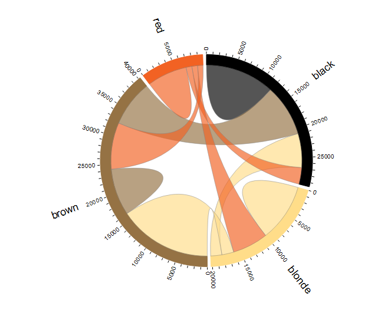
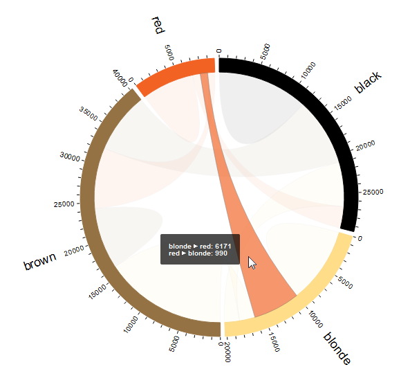

---
output:
  md_document:
    variant: markdown_github
---

<!-- README.md is generated from README.Rmd. Please edit that file -->

```{r, echo = FALSE}
knitr::opts_chunk$set(
  collapse = TRUE,
  comment = "#>",
  fig.path = "README-"
)
```

# Create a D3 Chord Diagram

The `chorddiag` package allows to create interactive chord diagrams using the JavaScript visualization library D3 (http://d3js.org) from within R using the `htmlwidgets` interfacing framework..
Chord diagrams show directed relationships among a group of entities.
The chord diagram layout is explained in detail here: https://github.com/mbostock/d3/wiki/Chord-Layout. 

To quote the explanation found there:

> Consider a hypothetical population of people with different hair colors: black, blonde, brown and red. Each person in this population has a preferred hair color for a dating partner; of the 29,630 (hypothetical) people with black hair, 40% (11,975) prefer partners with the same hair color. This preference is asymmetric: for example, only 10% of people with blonde hair prefer black hair, while 20% of people with black hair prefer blonde hair. A chord diagram visualizes these relationships by drawing quadratic Bézier curves between arcs. The source and target arcs represents two mirrored subsets of the total population, such as the number of people with black hair that prefer blonde hair, and the number of people with blonde hair that prefer black hair.

To create a chord diagram for this example, we need the preferences in matrix format:

```{r}
m <- matrix(c(11975,  5871, 8916, 2868,
              1951, 10048, 2060, 6171,
              8010, 16145, 8090, 8045,
              1013,   990,  940, 6907),
            byrow = TRUE,
            nrow = 4, ncol = 4)
groupNames <- c("black", "blonde", "brown", "red")

row.names(m) <- groupNames
colnames(m) <- groupNames
m
```

Then, the `chorddiag` function creates the chord diagram:

```{r, eval = FALSE}
library(chorddiag)
groupColors <- c("#000000", "#FFDD89", "#957244", "#F26223")
chorddiag(m, groupColors = groupColors, groupnamePadding = 20)
```



This diagram will be interactive when generated by the function.
Interactive here means chord fading and tooltip popups on certain mouse over events.
E.g. if the mouse pointer hovers over the chord connecting the "blonde" and "red" groups, a tooltip is displayed giving the numbers for the chord, and all other chords fade away.



The package's code is based on http://bl.ocks.org/mbostock/4062006, with modifications for fading behaviour and addition of tooltips.

The default chord diagram type is **directional** but chord diagrams can also be a useful visualization of relationships between two categories of groups, i.e. contingency tables.
In this package, this type of chord diagram is called **bipartite** (because there are only chords *between* categories but not *within* categories).
Here is an example for the `Titanic` dataset, depicting how many passengers from the different classes and from the crew survived or died when the ship sunk:


See the [vignette](vignettes/chorddiagram-vignette.Rmd) for more information.


## Updating to the latest version of chorddiag

You can track (and contribute to) development of `chorddiag` at https://github.com/mattflor/chorddiag. To install it, run the following command (this requires the `devtools` package):

```r
devtools::install_github("mattflor/chorddiag")
```
